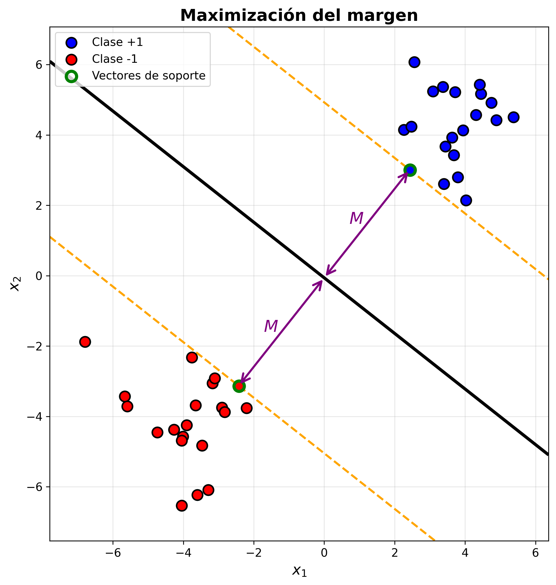
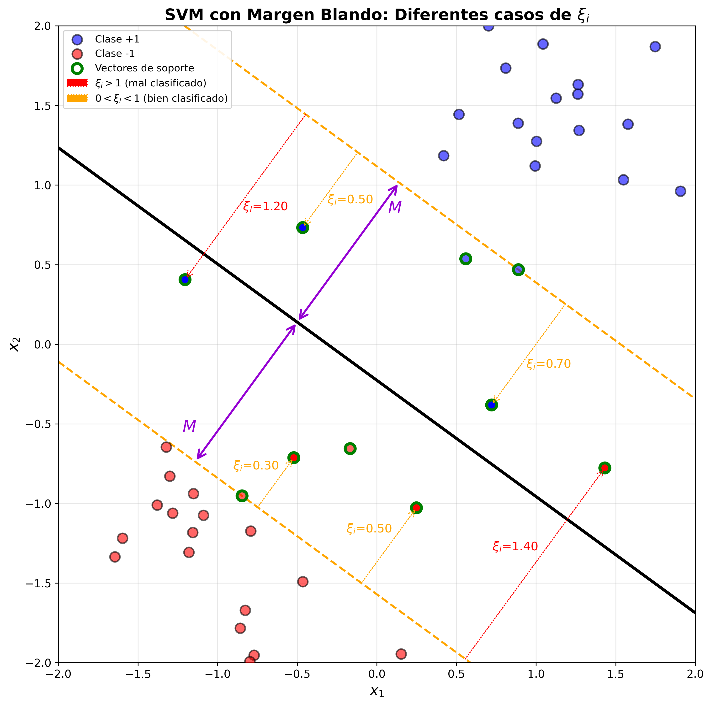

# Sesión 2: Support Vector Machines (SVM)

Las Support Vector Machines (SVM) [@cortes1995svm] son algoritmos de aprendizaje supervisado utilizados principalmente para clasificación, aunque también pueden aplicarse a regresión. 

## Aplicaciones de SVM

Aunque en la actualidad los modelos basados en aprendizaje profundo dominan en campos como la Visión por Computador (CV) o el Procesamiento del Lenguaje Natural (NLP), y en general cuando contamos con extensos conjuntos de datos y disponibilidad de gran capacidad de computación, modelos como SVM pueden ser competitivos cuando contemos con datos tabulares de tamaño pequeño o mediano.

SVM ofrece un buen rendimiento con  conjuntos de datos pequeños. A modo orientativo, con conjuntos de menos de 1.000 ejemplos puede resultar la opción más adecuada, y podría mantenerse competitivo incluso con _datasets_ del orden de 10.000 ejemplos.  Encontramos otros modelos que siguen ofreciendo resultados competitivos en estos casos, como XGBoost o Random Forest. 

Por ejemplo, un área en la que estos modelos pueden resultar de interés es en el análisis de datos médicos, en los que contamos con **_datasets_ pequeños** (datos de pacientes) pero con **alta dimensionalidad** (por ejemplo teniendo en cuenta la expresión de diferentes genes). Además, tenemos la ventaja de que este tipo de modelos facilita la **interpretabilidad**, lo cual los hace especialmente interesantes en estos ámbitos. 

## Maximización del margen

Como hemos visto anteriormente, en un problema de clasificación binaria buscamos encontrar un hiperplano que separe los datos de las dos clases, pero, ¿cuál es el hiperplano de separación óptimo? Lo que plantea SVM es buscar el hiperplano que **maximiza el margen** entre las dos clases, a diferencia del modelo de regresión logística en el que lo que se buscaba era maximizar la verosimilitud. Es decir, regresión logística proporciona probabilidades bien calibradas, mientras que SVM prioriza la robustez del margen, sin producir probabilidades de forma directa.

El margen será la distancia desde el hiperplano hasta los puntos más cercanos de cada clase. Estos puntos más cercanos son conocidos como **vectores de soporte** (ver ). 

Figure: Maximización del margen {#fig-margenduro}

Además, como veremos más adelante, SVM se puede generalizar para casos en los que los datos no sean separables de forma líneal. 

### Margen duro

Vamos en primer lugar a suponer que los datos son linealmente separables. Hablamos entonces de margen duro, ya que estableceremos la restricción de que los puntos pertenecientes a cada clase deben quedar siempre al lado correcto del margen.

Consideremos que tenemos un conjunto de entrenamiento con $N$ pares $(\mathbf{x_i}, y_i)$ con $\mathbf{x_i} \in \mathbb{R}^d$ y $y_i \in \{-1, 1\}$ (problema de clasificación binaria), siendo $d$ el número de _features_.

En caso de que el vector $\mathbf{w}$ sea unitario, la función $f(\mathbf{x})$ nos dará la distancia desde el hiperplano a cada punto $\mathbf{x}$. 

Con esto, para buscar el hiperplano que maximice el margen $M$, deberemos resolver el siguiente problema de optimización:

$$
\begin{align*}
\max_{\mathbf{w}, b, \lVert \mathbf{w}  \rVert=1} \quad  & M \\
\text{s.a.} \quad & y_i(\mathbf{x}_i^T\mathbf{w} + b) \geq M, i = 1, \ldots, N
\end{align*}
$$

Podemos eliminar la restricción de que $\mathbf{w}$ sea unitario dividiendo la ecuación del hiperplano entre $\lVert \mathbf{w} \rVert$. Si dividimos toda la ecuación seguirá representando al mismo hiperplano y nos permitirá  reemplazar la condición con:

$$
\frac{1}{\lVert \mathbf{w} \rVert} y_i(\mathbf{x}_i^T\mathbf{w} + b) \geq M
$$

O lo que es lo mismo:

$$
y_i(\mathbf{x}_i^T\mathbf{w} + b) \geq M \lVert \mathbf{w} \rVert
$$ 

En este caso, el hiperplano seguirá siendo el mismo independientemente del valor de $\lVert \mathbf{w} \rVert$. Por lo tanto, podemos considerar de forma arbitraria que $\lVert \mathbf{w} \rVert = 1 / M$, lo cual nos permite reescribir la restricción anterior de la siguiente forma:

$$
y_i(\mathbf{x}_i^T\mathbf{w} + b) \geq 1 
$$ 

#### Forma primal

Con lo anterior, el problema de optimización a resolver tendría la siguiente forma:

$$
\begin{align*}
\min_{\mathbf{w}, b} \quad & \mathbf{\lVert w \rVert} \\
\text{s.a.} \quad & y_i(\mathbf{x}_i^T\mathbf{w} + b) \geq 1, i = 1, \ldots, N
\end{align*}
$$

Esta es la conocida como **forma primal**, en la que tenemos nuestra función objetivo y una serie de restricciones. Podríamos resolver este problema aplicando algún método de optimización como descenso por gradiente, o descenso por gradiente estocástico (SGD), para buscar los parámetros $\mathbf{w}$ y $b$ óptimos. 

Sin embargo, vamos a utilizar el método de los **multiplicadores de Lagrange** [@boyd2004convex] para transformar este problema con restricciones a un problema en el que las restricciones se transforman en penalizaciones a la función objetivo.

El problema de optimización anterior sería equivalente al siguiente, ya que el mínimo de $\mathbf{\lVert w \rVert}$ será el mismo que el de $\frac{1}{2} \mathbf{\lVert w \rVert}^2$:

$$
\begin{align*}
\min_{ \mathbf{w}, b} \quad  & \frac{1}{2} \mathbf{\lVert w \rVert}^2 \\
\text{s.a.} \quad & y_i(\mathbf{x}_i^T\mathbf{w} + b) \geq 1, i = 1, \ldots, N
\end{align*}
$$

Sin embargo, esta segunda forma nos da ventajas importantes, especialmente la diferenciabilidad de $\frac{1}{2} \mathbf{\lVert w \rVert}^2$, que es derivable en todos sus puntos, mientras $\mathbf{\lVert w \rVert}$ no es derivable cuando $\mathbf{\lVert w \rVert}$ = 0. 

Debemos recordar que estamos asumiendo de momento que los datos son separables (**margen duro**), y por lo tanto consideramos únicamente dos casos posibles:

- $y_i(\mathbf{x}_i^T\mathbf{w} + b) > 1$ : correctamente clasificados fuera del margen.
- $y_i(\mathbf{x}_i^T\mathbf{w} + b) = 1$ : Vectores de soporte, pertenecientes al margen.

Para resolver el problema de optimización mediante multiplicadores de Lagrange, la función Lagrangiana primal que deberemos minimizar respecto a $\mathbf{w}$ y $b$ es la siguiente:

$$
L_P(\mathbf{w}, b, \alpha) = \frac{1}{2} \lVert \mathbf{w} \rVert^2 - \sum_{i=1}^N \alpha_i [ y_i ( \mathbf{x}_i^T \mathbf{w} + b ) - 1 ]
$$

Hemos transformado cada restricción en un término de la función a minimizar, y aplicado a cada uno de estos términos un multiplicador $\alpha_i$ (multiplicador de Lagrange). 

Derivamos la función anterior respecto a $\mathbf{w}$ y $b$, y establecemos las derivadas a $0$ para buscar el punto en el que la función presenta un mínimo (condición de estacionariedad). Tenemos entonces:

$$
\begin{align*}
\frac {\partial L(\mathbf{w}, b, \alpha)}{\partial \mathbf{w}} &= \mathbf{w} - \sum_{i=1}^N \alpha_i y_i \mathbf{x}_i = 0 & \Rightarrow \mathbf{w} = \sum_{i=1}^N \alpha_i y_i \mathbf{x}_i 
\\
\frac {\partial L(\mathbf{w}, b, \alpha)}{\partial b} &= \sum_{i=1}^N \alpha_i y_i  = 0  & \Rightarrow 0 = \sum_{i=1}^N \alpha_i y_i
\end{align*}
$$

Sustituyendo $\mathbf{w}$ en la Lagrangiana (teniendo en cuenta que $\lVert \mathbf{w} \rVert^2 = \mathbf{w}^T \mathbf{w}$) tenemos:

$$
\begin{align*}
L_D(\mathbf{w}, b, \alpha) &= \frac{1}{2}  \sum_{i=1}^N \alpha_i y_i \mathbf{x}_i^T \sum_{j=1}^N \alpha_j y_j \mathbf{x}_j   - \sum_{i=1}^N \alpha_i [ y_i ( \mathbf{x}_i^T \sum_{j=1}^N \alpha_j y_j \mathbf{x}_j + b ) - 1 ] = \\
&= \frac{1}{2}  \sum_{i=1}^N \alpha_i y_i \mathbf{x}_i^T \sum_{j=1}^N \alpha_j y_j \mathbf{x}_j    
- \sum_{i=1}^N \alpha_i y_i  \mathbf{x}_i^T \sum_{j=1}^N \alpha_j y_j \mathbf{x}_j 
- b \sum_{i=1}^N \alpha_i y_i  
+ \sum_{i=1}^N \alpha_i =
\\ 
&= \sum_{i=1}^N \alpha_i -
\sum_{i=1}^N \sum_{j=1}^N \alpha_i \alpha_j y_i y_j \mathbf{x}_i^T \mathbf{x}_j 
\end{align*}
$$

#### Forma dual

Tenemos entonces el problema dual. A diferencia del problema primal donde minimizábamos la norma de $\mathbf{w}$, ahora buscamos maximizar la función $L_D(\alpha)$:

$$
\begin{align*}
\max_\alpha \quad & L_D(\alpha) =  \sum_{i=1}^N \alpha_i -
\sum_{i=1}^N \sum_{j=1}^N \alpha_i \alpha_j y_i y_j \mathbf{x}_i^T \mathbf{x}_j 
\\
s.a.\quad  & \sum_{i=1}^N \alpha_i y_i  = 0 
\\
&\alpha_i \geq 0 \  \forall i=1, \ldots, N
\end{align*}
$$

Esto ocurre porque al transformar el problema mediante multiplicadores de Lagrange, la función dual nos proporciona una cota inferior del valor óptimo del problema primal, por lo que para encontrar la mejor solución debemos maximizar esta cota. 

Debemos destacar en este punto que en el caso de la forma dual deberemos optimizar los multiplicadores $\alpha_i$, en lugar de los parámetro $\mathbf{w}$ y $b$ como ocurría en el caso de la forma primal. 

Nos encontramos con un problema de **programación cuadrática (QP)** convexo con restricciones lineales. Este tipo de problemas tienen la siguiente forma general:

$$
f(\mathbf{\alpha}) = \frac{1}{2} \mathbf{\alpha}^T Q \mathbf{\alpha} + c^T \mathbf{\alpha}
$$

Para que el problema sea convexo, la matriz $Q$ debe ser semidefinida positiva, y esto se cumple en el caso de SVM, ya que tenemos:

$$ 
Q_{ij} = y_i y^j \mathbf{x}^T_i \mathbf{x}_j
$$

Podremos por lo tanto aplicar algún algoritmo de optimización para este tipo de problemas. Encontramos diferentes _solvers_, como por ejemplo [CVXOPT](https://cvxopt.org) o [OSQP](https://osqp.org/) en Python. 

En la práctica, el algoritmo más utilizado es SMO (_Sequential Minimal Optimization_) [@platt1998smo]. Este es el algoritmo utilizado por ejemplo por [LIBSVM](https://www.csie.ntu.edu.tw/~cjlin/libsvm/), que es la librería que encontramos integrada en [scikit-learn](https://scikit-learn.org/stable/). En este caso, en lugar, de resolver un problema QP completo con $N$ variables, selecciona solo dos variables $\alpha_i$ y $\alpha_j$ iterativamente, fijando el resto, las optimiza, e itera hasta la convergencia. 

#### Condiciones KKT

En un problema de optimización convexo con restricciones para que un punto sea óptimo debe satisfacer un conjunto de condiciones conocidas como condiciones KKT (Karush-Kuhn-Tucker) [@kuhn1951nonlinear;@boyd2004convex]:

1. **Estacionariedad**. Buscamos que la función Lagrangiana tenga gradiente $0$. Se cumple al haber igualado las derivadas a $0$. 
2. **Factibilidad**. El punto debe ser factible y cumplir las restricciones.
3. **Signo**. Todos los multiplicadores asociados a restricciones de desigualdad deben tener signo positivo:
$$
\alpha_i \geq 0 \quad \forall i=1, \ldots, N
$$  

4. **Complementariedad**. Además de las condiciones anteriores, es importante cumplir también la siguiente condición:

$$
\alpha_i [ y_i ( \mathbf{x}_i^T \mathbf{w} + b) - 1 ] = 0 \quad \forall i=1, \ldots, N
$$

Esta última condición nos dice que:

- Si $\alpha_i > 0$, entonces la restricción es activa y debe cumplirse $[ y_i ( \mathbf{x}_i^T \mathbf{w} + b) - 1 ] = 0$. Estos serán los puntos conocidos como **vectores de soporte**, que se encuentran justo en el margen de separación.

- En caso de que $y_i (\mathbf{x}_i^T \mathbf{w} + b) > 1$, entonces el punto estará fuera del margen y la restricción no será activa, siendo $\alpha_i = 0$. En este caso no se tratará de un vector de soporte.

Es importante destacar que solo los puntos con $\alpha_i > 0$ (vectores de soporte) contribuyen a la solución. El resto de puntos no afectarán al hiperplano. 

A partir de la función obtenida al calcular la derivada parcial respecto a cada uno de los coeficientes, podemos observar que $\mathbf{w}$ se obtendrá como combinación lineal de los vectores de soporte $\mathbf{x}_i$ (aquellos con $\alpha_i > 0$):

$$
\mathbf{w} = \sum_{i=1}^N \alpha_i y_i \mathbf{x}_i 
$$

 El parámetro $b$ se puede obtener resolviendo la condición de complementariedad para cualquiera de los vectores de soporte.

### Margen blando

Todo lo anterior es válido bajo la suposición de que los datos son linealmente separables, pero si esto no se cumple entonces el problema primal no tendrá solución. 

Supongamos ahora que existe un solape entre los datos. Una forma de tratar con este solape es maximizar $M$ permitiendo que algunos datos estén en el lado incorrecto del margen, para lo cual se definen las variables $\xi = (\xi_1, \xi_2, \ldots, \xi_N)$, relajando la restricción del primal de la siguiente forma:

$$
y_i(\mathbf{x}_i^T\mathbf{w} + b) \geq 1 - \xi_i \quad \forall i, \xi_i \geq 0
$$ 

Podemos interpretar $\xi_i$ como la cantidad proporcional que permitimos que una predicción esté en el lado incorrecto del margen (ver ). Si tenemos $\xi_i > 1$ entonces la correspondiente predicción estaría mal clasificada, mientras que con valores $0 < \xi_i < 1$ estaría correctamente clasificada pero en el lado incorrecto del margen.

Figure: Margen blando y variables $\xi_i$ {#fig-margenblando}

Si acotamos el sumatorio $\sum_{i=1}^N \xi_i$ a un valor constante, entonces estaremos acotando el número máximo de errores de clasificación de los datos de entrenamiento a dicha constante. Esto lo trasladaremos como una penalización a nuestra función objetivo.

#### Forma primal

Al igual que hicimos en el caso con margen duro, describimos el problema como una solución de programación cuadrática utilizando multiplicadores de Lagrange, en este caso introduciendo las variables $\xi_i$, con la siguiente función objetivo:

$$
\begin{align*}
\min_{ \mathbf{w}, b} \quad  & \frac{1}{2} \mathbf{\lVert w \rVert}^2 + C \sum^N_{i=1} \xi_i \\
\text{s.a.} \quad & \xi_i \geq 0,\ y_i(\mathbf{x}_i^T\mathbf{w} + b) \geq 1 - \xi_i, \quad \forall i = 1, \ldots, N
\end{align*}
$$

Podemos ver que el parámetro $C$ gradúa la penalización de las variables $\xi_i$. Cuanto más alto sea $C$, más penalizará cada punto fuera del margen. En el caso extremo, con $C=\infty$ equivaldría al caso con margen duro y no se permitiría ningún punto en el lado incorrecto del margen.

La función de Langrange primal en este caso es:

$$
L_P(\mathbf{w}, b, \xi, \alpha, \mu) = \frac{1}{2} \lVert \mathbf{w} \rVert^2 + C \sum^N_{i=1} \xi_i - \sum_{i=1}^N \alpha_i [ y_i ( \mathbf{x}_i^T \mathbf{w} + b ) - (1-\xi_i) ] - \sum_{i=1}^N \mu_i \xi_i
$$

Tendremos que minimizar esta función respecto a $\mathbf{w}$, $b$ y $\xi_i$, por lo que igualaremos las correspondientes derivadas a $0$:

$$
\begin{align*}
\frac {\partial L_P(\mathbf{w}, b, \xi, \alpha, \mu)}{\partial \mathbf{w}} &= \mathbf{w} - \sum_{i=1}^N \alpha_i y_i \mathbf{x}_i = 0 & \Rightarrow \mathbf{w} = \sum_{i=1}^N \alpha_i y_i \mathbf{x}_i 
\\
\frac {\partial L_P(\mathbf{w}, b, \xi, \alpha, \mu)}{\partial b} &= \sum_{i=1}^N \alpha_i y_i  = 0 
& \Rightarrow 0 = \sum_{i=1}^N \alpha_i y_i  
\\
\frac {\partial L_P(\mathbf{w}, b, \xi, \alpha, \mu)}{\partial \xi_i} &= C - \alpha_i - \mu_i = 0
& \Rightarrow \alpha_i = C - \mu_i
\end{align*}
$$

#### Forma dual

Sustituyendo las derivadas anteriores en la función primal, obtenemos la forma dual:

$$
\begin{align*}
\max_\alpha \quad & L_D(\alpha) =  \sum_{i=1}^N \alpha_i -
\sum_{i=1}^N \sum_{j=1}^N \alpha_i \alpha_j y_i y_j \mathbf{x}_i^T \mathbf{x}_j 
\\
s.a.\quad  & \sum_{i=1}^N \alpha_i y_i  = 0 
\\
&0 \leq \alpha_i \leq C \quad  \forall i=1, \ldots, N
\end{align*}
$$

La función $L_D$ nos da una cota inferior de la función objetivo para cualquier punto viable, por lo que buscaremos maximizarla. 

Además, se deben cumplir las diferentes condiciones KKT:

1. **Estacionariedad**. Se cumple habiendo igualado las derivadas a $0$.

2. **Factibilidad**. Deben cumplirse las restricciones originales del problema primal:
$$ 
y_i(\mathbf{x}_i^T\mathbf{w} + b)  \geq 1 - \xi_i \quad \forall i
$$
$$
\xi_i  \geq 0 \quad \forall i
$$

3. **Signo**. Los multiplicadores asociados a restricciones de desigualdad no deben ser negativos:
$$ 
\alpha_i  \geq 0 \quad \forall i
$$
$$
\mu_i  \geq 0 \quad \forall i
$$

4. **Complementariedad**. Esta es la más importante a tener en cuenta, ya que define qué restricciones son activas (aquellas con parámetros $\alpha_i > 0$ y $\mu_i > 0$), indicando de esta forma cuáles son los **vectores de soporte**. 
$$
\alpha_i[y_i(\mathbf{x}_i^T \mathbf{w} + b) - 1 + \xi_i] = 0 \quad \forall i
$$
$$
\mu_i \xi_i = 0 \Rightarrow (C-\alpha_i) \xi_i = 0 \quad \forall i 
$$

Podemos distinguir varios casos:

- $\alpha_i = 0$. Son puntos correctamente clasificados, que no son vectores de soporte. En este caso siempre tendremos $\xi_i = 0$ debido a las condiciones de complementariedad.

- $0 <  \alpha_i < C$. Estos son los vectores de soporte que se sitúan exactamente en el margen. En estos casos $\mu_i > 0$, y por lo tanto $\xi_i = 0$, por lo que no hay violación del margen.

- $\alpha_i = C$. En este caso tenemos vectores de soporte que violan el margen. En estos casos $\mu_i = 0$, por lo que podemos tener $\xi_i > 0$. Teniendo en cuenta que se debe cumplir $y_i (\mathbf{x}^T_i \mathbf{w} + b) = 1 - \xi_i$, si $0 < \xi_i < 1$ entonces el vector viola el margen pero estará bien clasificado, mientras que en caso de que $\xi > 1$ entonces estará mal clasificado.

Una vez resuelto el problema de optimización y obtenidos los $\alpha_i$ óptimos, podemos observar que los coeficientes $\mathbf{w}$ se obtendrían como combinación lineal únicamente de los vectores de soporte (entradas $\mathbf{x_i}$ para las que $\alpha_i > 0$):

$$
\mathbf{w} = \sum_{i=1}^N \alpha_i y_i \mathbf{x}_i 
$$

Una vez obtenidos los coeficientes, para despejar $b$, podemos utilizar cualquiera de los puntos del margen ($\alpha_i > 0$, $\xi_i = 0$) en la primera ecuación de la restricción de complementariedad, aunque habitualmente se suele hacer una media de la estimación de todos ellos para tener una mayor estabilidad numérica. 

#### Efecto del parámetro C

Es importante entender el rol del parámetro $C$:

- Con valores altos de $C$, se penalizarán $\xi_i$ positivos, y podremos tender al _overfitting_. 
- Por el contrario, con valores bajos de $C$ se tenderá a valores pequeños de $\lVert \mathbf{w} \rVert$, lo que causará que la frontera sea más suave (ampliando el margen).

\bibliography